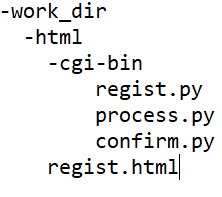
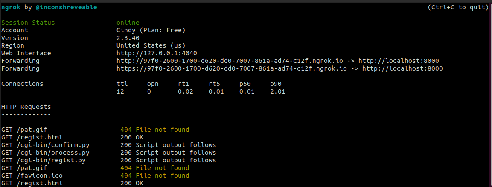
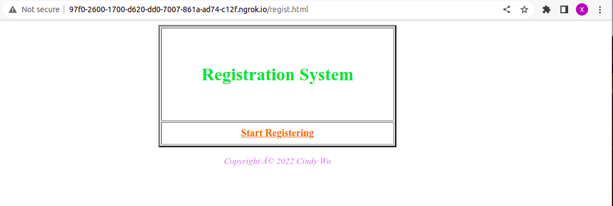
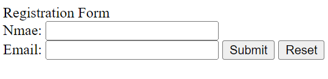
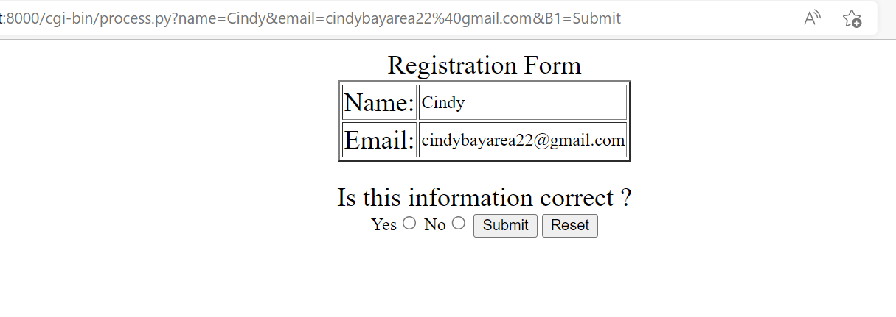
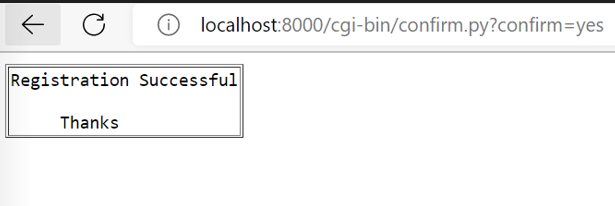
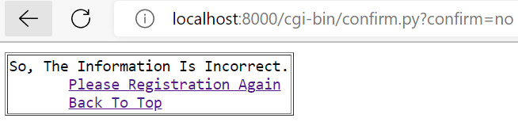

# Simple registration system using CGI API

## Description
Implement a simple personal registration system. 
1. Main website page with "Start register" click button.
2. "Register form" page, used for user to enter their personal information
3. Process the personal information and let user to confirm the correctness of it.
4. If confirmation is ok, store user information into database, send confirmation email to user's email and show "sucessful" page; 
   otherwise back to main page or registration form page.
5. Use NGRok to map a local private address to a public address, so that anyone in the world can access this web server.

## Code Structure

## Enviroment Setup
Platform: Windows WSL ubuntu
### web server setup
Please follow the document [web_server_setup.pdf](https://github.com/groovyxw/Python_Application_Programming/blob/main/Simple%20Registration%20System/MySql_setup.pdf) to do the basic setup

### MySql setup
Please follow the document [MySql_setup.pdf](https://github.com/groovyxw/Python_Application_Programming/blob/main/Simple%20Registration%20System/MySql_setup.pdf) to do the neccessary MySql setup
### NGrok setup
 PS: Please refer to the NGrok_setup.pdf for installation

## How to run it?

-download code
   > $ git clone url
    
-enter html directory
   > $ cd html
   
   > $ mv cgi-bin_v2 cgi-bin
   
-start the web server
   > $ python3 -m http.server --cgi
   
-start ngrok service in a new termal
   > $ ./ngrok http 8000

  

    
-open the website on browser, e.g. Chrome
   > http://localhost:8000/regist.html (for internal test)
   
   
   > http://97f0-2600-1700-d620-dd0-7007-861a-ad74-c12f.ngrok.io/regist.html (for external visiting, may change in your run)
    
-Register according to the web page
(Some reference screenshots are attached below)

# Presentation: 
https://docs.google.com/presentation/d/1FyIrlJA3WTnbzaDEfuleL5Q8c7wE7_NfK12bjw21T9o/edit?usp=sharing
