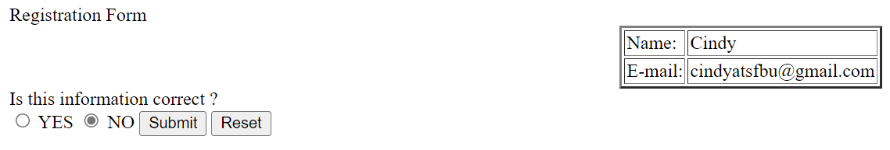

# Simple registration system using CGI API

## Description

## Code Structure

## How to run it?

Platform: Windows WSL ubuntu

-download code
   > $ git clone url
    
-enter html directory
   > $ cd html

-start the web server
   > $ python3 -m http.server --cgi
    
-open the website on browser, e.g. Chrome
   > http://localhost:8000/regist.html
    
-Register according to the web page
(Reference screenshots are attached below)

# Presentation: 
https://docs.google.com/presentation/d/1FyIrlJA3WTnbzaDEfuleL5Q8c7wE7_NfK12bjw21T9o/edit?usp=sharing
