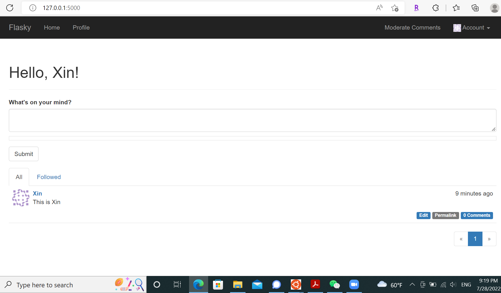
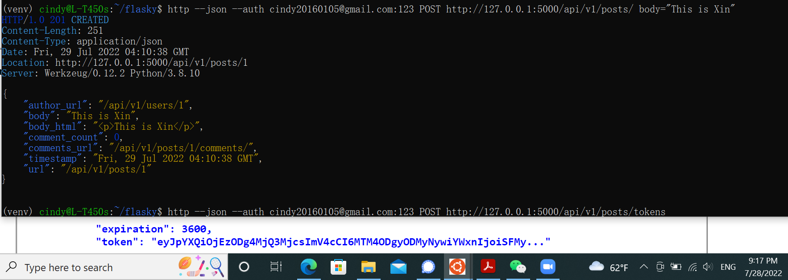

Flasky
======

This repository contains the source code examples for the second edition of my O'Reilly book [Flask Web Development](http://www.flaskbook.com).

The commits and tags in this repository were carefully created to match the sequence in which concepts are presented in the book. Please read the section titled "How to Work with the Example Code" in the book's preface for instructions.

For Readers of the First Edition of the Book
--------------------------------------------

The code examples for the first edition of the book were moved to a different repository: [https://github.com/miguelgrinberg/flasky-first-edition](https://github.com/miguelgrinberg/flasky-first-edition).

#How to run it?

- download the repo.
$ git clone url

-go to project folder
$ cd flasky

-set virtual environment

$ python3 -m venv venv

-activate virt. environment

$ . venv/bin/activate

-install requirements and dependencies
$pip install wheel
$ pip install -r requirements/prod.txt

-export environ. variable

$ export FLASK_APP=flasky.py
$ export MAIL_USERNAME=<EMAIL>
$ export MAIL_PASSWARD=<PWD>

-set database and migrations.

$ flask db stamp head
$ flask db migrate
$ flask db upgrade
- run app
$ flask run
- go to http://127.0.0.1:5000/
- register using email and pwd.
  

  
  
- go back to the terminal.
- python3 -m flask deploy
- python3 -m flask run
  
-open 2nd terminal
$ sqlite3 data-dev.sqlite
- set your user as confirmed manually.
$ UPDATE users SET confirmed=1 WHERE id=1;
$ UPDATE users SET role_id=3 WHERE id=1;
$ exit;
Start using the app at http://127.0.0.1:5000

